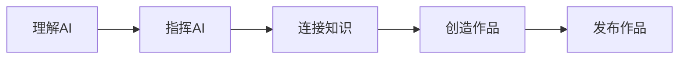
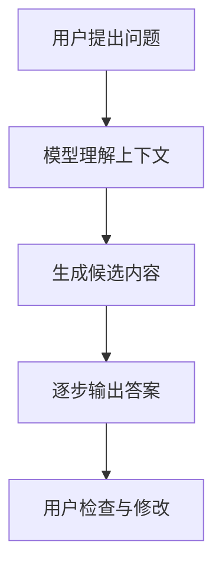
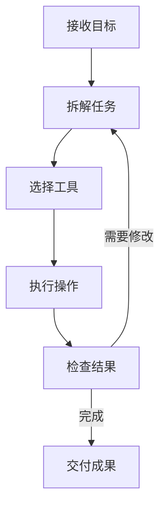
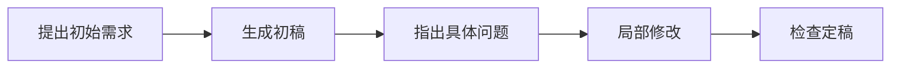
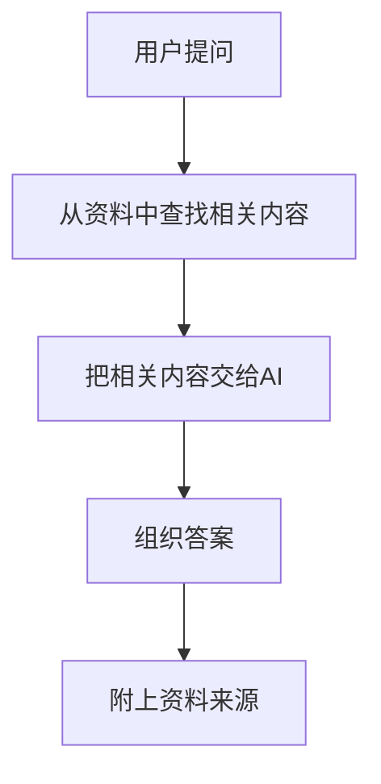
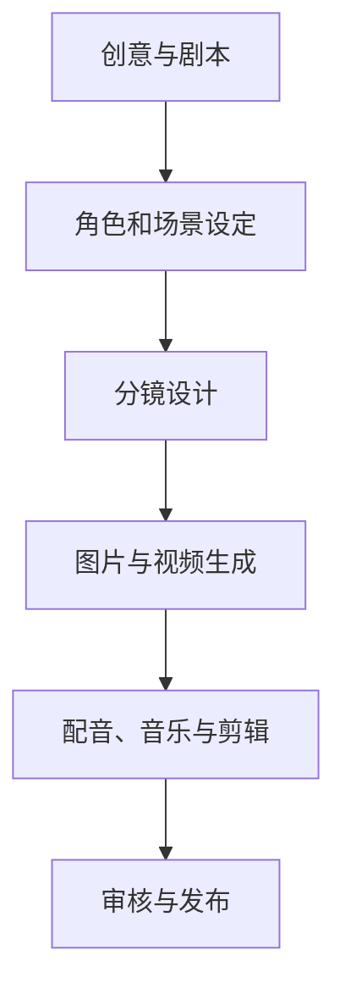

# 《AI新生第一课：从会用工具，到创造作品》

副标题：AI、智能体、提示词、知识库、GitHub与AIGC入门

---

# 一、整体结构

|模块|页码|页数|建议时间|
|---|--:|--:|--:|
|开场：AI已经来到每个人身边|1—4|4页|8分钟|
|第一章：什么是AI|5—13|9页|15分钟|
|第二章：AI智能体|14—24|11页|22分钟|
|第三章：提示词工程|25—33|9页|18分钟|
|第四章：AI知识库|34—41|8页|15分钟|
|第五章：GitHub基础|42—49|8页|15分钟|
|第六章：AIGC内容创作|50—62|13页|27分钟|
|第七章：作品发布与未来职业|63—69|7页|15分钟|
|结尾：开始你的第一个AI项目|70|1页|5分钟|

---

# 开场：AI已经来到每个人身边

## 第1页｜封面

标题：

> AI新生第一课  
> 从会用工具，到创造作品

页面内容：

- AI × 智能体 × 提示词 × 知识库
    
- GitHub × AIGC × 未来职业
    
- 主讲人、学校、日期
    

演讲提醒：

- 不要一开始介绍复杂概念。
    
- 先告诉大家：今天不是计算机专业课，也不要求会编程。
    
- 今天的目标是建立一张“AI世界地图”。
    

---

## 第2页｜你今天可能已经用过AI

页面内容：

- 手机拍照优化
    
- 短视频推荐
    
- 地图路线规划
    
- 输入法联想
    
- 音乐推荐
    
- 智能客服
    
- 内容生成
    

演讲提醒：

- AI并不等于ChatGPT。
    
- 很多AI早已藏在日常生活中，只是大家没有意识到。
    

---

## 第3页｜同样一部手机，为什么有人能创造更多价值？

页面内容：

对比两个使用方式：

- 把AI当搜索框：问一个问题，得到一个答案
    
- 把AI当工作伙伴：分析、规划、创作、执行、迭代
    

演讲提醒：

- 工具差距正在缩小，使用方式的差距正在扩大。
    
- 今天不比谁知道的工具多，而是学习一套可迁移的方法。
    

---

## 第4页｜今天要完成一张AI能力地图

页面内容：

演讲提醒：

- 简单介绍七个章节。
    
- 强调这些内容并非相互独立，而是一条完整的创作链路。
    

---

# 第一章：什么是AI

## 第5页｜AI究竟是什么？

页面内容：

> AI是让机器完成某些原本需要人类智能才能完成的任务。

举例：

- 识别
    
- 预测
    
- 理解
    
- 生成
    
- 决策
    
- 执行
    

演讲提醒：

- 不要陷入学术定义。
    
- 重点说明：AI不是“真的变成人”，而是在特定任务上表现出智能。
    

---

## 第6页｜我们今天说的AI，其实有很多种

页面内容：

- 识别型AI：识别人脸、语音、图片
    
- 预测型AI：推荐内容、预测需求
    
- 生成式AI：生成文字、图片、视频、音乐
    
- 智能体：围绕目标连续完成任务
    

演讲提醒：

- 帮大家区分“推荐算法”“生成式AI”和“智能体”。
    
- 为后面的智能体章节埋下伏笔。
    

---

## 第7页｜机器学习不是背答案，而是从数据中找规律

页面内容：

简化关系：

> 数据 → 学习规律 → 面对新问题 → 给出判断

示例：

- 看过大量猫的图片
    
- 学会猫的常见特征
    
- 判断一张新图片是不是猫
    

演讲提醒：

- 可以用“学生刷题”类比。
    
- 说明模型能学到规律，但不一定真正理解世界。
    

---

## 第8页｜大模型为什么看起来会聊天？

页面内容：

- 学习了海量文本中的语言规律
    
- 根据上下文预测合适的后续内容
    
- 能完成问答、总结、翻译、创作和推理
    
- 本质上仍可能生成错误信息
    

演讲提醒：

- 可以用“超级语言接龙”帮助理解。
    
- 但提醒大家：大模型已经不只是简单接龙，它能在复杂上下文中完成多步骤任务。
    

---

## 第9页｜AI生成答案的基本过程

页面内容：

演讲提醒：

- 重点放在最后一步：人必须检查。
    
- AI输出流畅，不等于内容一定正确。
    

---

## 第10页｜生成式AI擅长什么？

页面内容：

- 快速整理信息
    
- 总结和改写
    
- 激发创意
    
- 生成初稿
    
- 多语言转换
    
- 辅助编程
    
- 制作多媒体内容
    

演讲提醒：

- AI最适合从0到1做初稿，也适合从1到10反复优化。
    
- 不要把“辅助”说成“完全替代”。
    

---

## 第11页｜生成式AI不擅长什么？

页面内容：

- 保证所有事实都正确
    
- 自动理解所有隐含背景
    
- 替你承担责任
    
- 准确预测未来
    
- 代替真实调查和专业判断
    

演讲提醒：

- 引出“AI幻觉”。
    
- 医疗、法律、金融、学术等高风险场景必须核验。
    

---

## 第12页｜AI为什么会一本正经地说错话？

页面内容：

关键词：

> AI幻觉：模型生成了看似合理、实际上错误或不存在的信息。

常见表现：

- 编造数据
    
- 编造文献
    
- 混淆人物
    
- 错误引用
    
- 过度推断
    

演讲提醒：

- 强调“语言自信”和“事实正确”是两件事。
    
- 给出原则：重要信息至少进行一次独立验证。
    

---

## 第13页｜使用AI的四条底线

页面内容：

1. 不上传敏感信息
    
2. 不直接相信所有答案
    
3. 不侵犯版权和他人隐私
    
4. 不把自己的判断完全外包给AI
    

演讲提醒：

- 敏感信息包括身份证、密码、未公开资料、同学隐私等。
    
- AI素养不仅是会使用，也包括知道什么时候不能用。
    

---

# 第二章：AI智能体

## 第14页｜会回答问题，不等于会完成任务

页面内容：

- 聊天机器人：你问一次，它答一次
    
- AI智能体：理解目标、拆解任务、使用工具、持续执行
    

演讲提醒：

- 用“咨询顾问”和“项目助理”的区别来类比。
    
- 从问答走向任务执行，是智能体最重要的变化。
    

---

## 第15页｜什么是AI智能体？

页面内容：

> AI智能体是能够围绕一个目标，进行观察、思考、行动和反馈的AI系统。

四个关键词：

- 目标
    
- 规划
    
- 工具
    
- 反馈
    

演讲提醒：

- 不需要深入讲技术框架。
    
- 让学生记住：智能体的核心不是更会聊天，而是更会办事。
    

---

## 第16页｜智能体是怎么工作的？

页面内容：

演讲提醒：

- 重点讲“检查—修改—再次执行”的循环。
    
- 智能体不是一步到位，而是边做边修正。
    

---

## 第17页｜智能体可以调用哪些工具？

页面内容：

- 浏览器
    
- 搜索引擎
    
- 文档与表格
    
- 代码编辑器
    
- 数据库
    
- 日历与邮件
    
- 企业内部系统
    

演讲提醒：

- AI模型相当于“大脑”，工具相当于“手脚”。
    
- 没有权限的智能体不能随意操作外部系统。
    

---

## 第18页｜WorkBuddy：面向日常工作的AI伙伴

页面内容：

可以展示的典型场景：

- 整理资料
    
- 总结文档
    
- 生成报告
    
- 制作表格
    
- 处理文件
    
- 辅助完成重复性工作
    

演讲提醒：

- 根据现场使用版本展示实际功能。
    
- 不必讲产品参数，重点展示“提出目标—执行—交付”的过程。
    

---

## 第19页｜WorkBuddy演示：完成一份新生学习计划

页面内容：

演示任务：

> 根据课程表、社团活动和个人目标，制定一份可执行的一周学习计划。

观察点：

- 是否会主动读取资料
    
- 是否会拆解目标
    
- 是否能生成具体成果
    
- 是否需要人工纠正
    

演讲提醒：

- 准备好备用截图，防止现场网络或系统异常。
    
- 故意展示一次修改过程，让学生看到AI需要协作。
    

---

## 第20页｜Codex：能在代码项目中工作的AI智能体

页面内容：

Codex可协助：

- 阅读代码项目
    
- 查找文件
    
- 修改代码
    
- 运行测试
    
- 定位错误
    
- 生成说明文档
    
- 创建简单应用
    

演讲提醒：

- 强调“不懂代码也能提出需求”，但使用者仍需学会验收。
    
- Codex不是“一句话自动生成完美软件”。
    

---

## 第21页｜Codex演示：创建一个简单网页

页面内容：

示例需求：

> 创建一个“大学生AI工具导航”网页，包含工具分类、搜索框和学习建议。

演示步骤：

- 描述目标
    
- 查看生成计划
    
- 让Codex创建代码
    
- 预览网页
    
- 提出修改意见
    

演讲提醒：

- 展示自然语言如何转化为文件和代码。
    
- 让学生感受到“表达需求”本身已经是一项重要能力。
    

---

## 第22页｜WorkBuddy和Codex有什么不同？

|对比维度|WorkBuddy|Codex|
|---|---|---|
|主要场景|日常办公与任务处理|软件和代码项目|
|常见对象|文档、表格、资料|代码、文件、项目|
|适合人群|广泛用户|编程学习者与开发者|
|共同点|理解目标并调用工具完成任务|理解目标并调用工具完成任务|

演讲提醒：

- 不必讨论谁更强。
    
- 选择工具取决于任务类型。
    

---

## 第23页｜使用智能体，最重要的是任务说明书

页面内容：

一份清晰的任务说明应包含：

- 要做什么
    
- 给谁使用
    
- 有哪些资料
    
- 有什么限制
    
- 最终交付什么
    
- 如何判断完成
    

演讲提醒：

- 智能体能力越强，人的任务定义能力越重要。
    
- 为下一章“提示词工程”建立逻辑连接。
    

---

## 第24页｜不要把智能体当成无人监督的员工

页面内容：

人类需要负责：

- 授权范围
    
- 数据安全
    
- 过程检查
    
- 结果验收
    
- 最终责任
    

演讲提醒：

- 特别提醒自动发送邮件、修改文件、发布内容等操作。
    
- 原则：权限越大，检查越严格。
    

---

# 第三章：提示词工程

## 第25页｜提示词不是咒语，而是任务沟通

页面内容：

> 好的提示词，本质上是一份清晰的任务说明。

演讲提醒：

- 不要让学生迷信所谓“万能提示词”。
    
- 提示词工程更接近表达、沟通和项目管理。
    

---

## 第26页｜为什么同一个AI，别人用起来更聪明？

页面内容：

结果差异常来自：

- 背景是否充分
    
- 目标是否清晰
    
- 要求是否具体
    
- 输出格式是否明确
    
- 是否持续反馈修改
    

演讲提醒：

- 模型相同，输入和协作方式不同，结果就会明显不同。
    

---

## 第27页｜一个实用的提示词公式

页面内容：

> 角色 + 背景 + 任务 + 要求 + 输出格式 + 评价标准

演讲提醒：

- 公式是检查清单，不是每次都必须写满。
    
- 简单问题用简单提示词，复杂任务才需要完整结构。
    

---

## 第28页｜把模糊需求变成清晰任务

页面内容：

普通版：

> 帮我写一篇大学生活文章。

改进版：

> 面向刚入学的大一新生，写一篇800字左右的公众号文章，主题是如何适应大学生活。语言轻松真实，包含三个具体建议，避免说教。

演讲提醒：

- 现场让学生比较两种提示词的结果差异。
    
- 强调“具体”不是“越长越好”。
    

---

## 第29页｜给AI足够的背景

页面内容：

背景可以包括：

- 使用对象
    
- 使用场景
    
- 已有资料
    
- 已做尝试
    
- 时间和资源限制
    
- 不希望出现的内容
    

演讲提醒：

- AI不知道你脑子里没有说出来的信息。
    
- 背景越准确，反复修改的成本越低。
    

---

## 第30页｜告诉AI最终要交付什么

页面内容：

常见输出格式：

- 表格
    
- 清单
    
- PPT大纲
    
- 演讲提纲
    
- JSON
    
- 网页代码
    
- 分镜脚本
    
- 执行计划
    

演讲提醒：

- “给我一些建议”容易得到泛泛而谈的内容。
    
- “输出一张包含时间、任务和成果的表格”更容易执行。
    

---

## 第31页｜让AI先提问，再开始工作

页面内容：

示例：

> 在开始之前，请先向我提出3个最关键的问题。得到回答后，再制定方案。

演讲提醒：

- 复杂需求的信息通常不完整。
    
- 会让AI提问，是一种非常实用的协作技巧。
    

---

## 第32页｜好结果通常来自多轮迭代

页面内容：

演讲提醒：

- 不要因为第一次结果不好，就断定工具不行。
    
- 修改意见要具体，例如“删掉空话”“增加一个校园案例”。
    

---

## 第33页｜一份可直接使用的万能任务模板

页面内容：

> 你是一名【角色】。  
> 背景是【背景信息】。  
> 请完成【具体任务】。  
> 目标对象是【使用者】。  
> 请遵守【限制与要求】。  
> 最终以【格式】输出。  
> 完成后按照【评价标准】自检。

演讲提醒：

- 建议学生拍照保存。
    
- 说明以后使用任何AI工具，都可以从这个框架开始。
    

---

# 第四章：什么是AI知识库

## 第34页｜为什么AI有时不了解你的资料？

页面内容：

通用大模型通常不知道：

- 你的课堂资料
    
- 你的个人笔记
    
- 学校内部制度
    
- 企业内部文档
    
- 最新项目进度
    
- 未公开专业资料
    

演讲提醒：

- 引出知识库的必要性。
    
- 大模型“知识很多”，但不等于“了解你的资料”。
    

---

## 第35页｜AI知识库是什么？

页面内容：

> AI知识库是把特定资料整理后提供给AI，让它基于这些资料回答问题。

常见资料：

- PDF
    
- Word
    
- PPT
    
- 网页
    
- 表格
    
- 会议记录
    
- 学习笔记
    

演讲提醒：

- 可以类比“给AI发一本指定教材，再让它开卷回答”。
    

---

## 第36页｜知识库问答的基本过程

页面内容：

演讲提醒：

- 不需要展开向量数据库、Embedding等技术细节。
    
- 学生只需理解“先检索资料，再生成答案”。
    

---

## 第37页｜知识库和普通聊天有什么区别？

|普通聊天|知识库问答|
|---|---|
|依赖模型已有知识|优先使用指定资料|
|可能不了解内部信息|可以读取授权资料|
|来源不一定清楚|可以追溯引用|
|适合通用问题|适合专业和内部问题|

演讲提醒：

- 知识库并不能彻底消除错误。
    
- 关键答案仍需回到原文检查。
    

---

## 第38页｜大学生可以建立哪些知识库？

页面内容：

- 一门课程的复习知识库
    
- 专业文献知识库
    
- 考研或考证资料库
    
- 社团活动资料库
    
- 个人作品资料库
    
- 求职信息知识库
    

演讲提醒：

- 建议从“一门课程”开始，不要一上来导入所有文件。
    

---

## 第39页｜资料越多，知识库就越好吗？

页面内容：

不一定。

常见问题：

- 重复文件过多
    
- 版本互相冲突
    
- 扫描文件无法识别
    
- 文件命名混乱
    
- 过期资料没有删除
    
- 权限边界不清楚
    

演讲提醒：

- 知识库建设首先是资料治理，然后才是AI问答。
    

---

## 第40页｜建立知识库的五个步骤

页面内容：

1. 确定使用目标
    
2. 收集可靠资料
    
3. 分类并统一命名
    
4. 导入知识库工具
    
5. 测试、纠错和更新
    

演讲提醒：

- 强调测试问题要来自真实需求。
    
- 不能只问资料标题里就有答案的问题。
    

---

## 第41页｜知识库安全：不是所有资料都能上传

页面内容：

上传前检查：

- 是否包含个人隐私
    
- 是否属于内部资料
    
- 是否涉及商业秘密
    
- 是否有版权限制
    
- 工具是否允许删除
    
- 数据会被如何使用
    

演讲提醒：

- “能上传”不代表“应该上传”。
    
- 不确定时，先去除敏感信息或咨询资料负责人。
    

---

# 第五章：GitHub基础

## 第42页｜用AI做作品，为什么还要认识GitHub？

页面内容：

> 因为作品不仅要生成，还要保存、修改、协作和发布。

演讲提醒：

- 这一章不是教大家写复杂代码。
    
- 目标是消除学生看到GitHub时的陌生感。
    

---

## 第43页｜Git、GitHub和代码仓库不是一回事

页面内容：

- Git：记录文件修改历史的版本控制工具
    
- GitHub：托管和协作代码项目的平台
    
- Repository：存放项目文件和历史记录的仓库
    

演讲提醒：

- Git像“版本管理系统”。
    
- GitHub像“项目存放和协作平台”。
    

---

## 第44页｜一个仓库里通常有什么？

页面内容：

- README：项目说明书
    
- 源代码文件
    
- 图片与素材
    
- 配置文件
    
- LICENSE：使用许可
    
- 提交记录
    
- Issues：问题和任务
    

演讲提醒：

- 现场打开一个结构简单的开源项目。
    
- 优先让学生学会看README。
    

---

## 第45页｜Commit：给作品留下一个可回到的版本

页面内容：

> Commit可以理解为一次带说明的版本存档。

示例：

- 完成首页设计
    
- 修复搜索按钮
    
- 更新项目说明
    
- 增加移动端适配
    

演讲提醒：

- 类比游戏存档或文档历史版本。
    
- 提交说明应该写清楚改了什么。
    

---

## 第46页｜Branch：在不破坏主版本的情况下尝试

页面内容：

- Main：主要版本
    
- Branch：独立修改路线
    
- Merge：将修改合并回来
    

演讲提醒：

- 类比“复制一份草稿进行修改”。
    
- 这里只建立概念，不讲复杂Git命令。
    

---

## 第47页｜Fork、Clone和Download有什么区别？

页面内容：

- Fork：把别人的仓库复制到自己的GitHub账号
    
- Clone：把仓库复制到本地并保留版本关系
    
- Download ZIP：只下载当前文件
    
- Star：收藏并表达关注
    

演讲提醒：

- Download ZIP适合只想看文件的人。
    
- 想持续修改和同步项目，更适合Clone或Fork。
    

---

## 第48页｜README是作品的第一张名片

页面内容：

一份README应说明：

- 项目是什么
    
- 解决什么问题
    
- 如何使用
    
- 项目截图
    
- 使用技术
    
- 作者与联系方式
    
- 版权或许可说明
    

演讲提醒：

- AI作品完成后，不要只留下一堆无法理解的文件。
    
- README也是表达和展示能力的一部分。
    

---

## 第49页｜让Codex帮助管理GitHub项目

页面内容：

Codex可以协助：

- 理解仓库结构
    
- 编写README
    
- 修改文件
    
- 解释代码
    
- 运行测试
    
- 整理提交说明
    
- 排查问题
    

演讲提醒：

- AI降低了参与开源和软件创作的门槛。
    
- 但提交前一定要查看AI修改了哪些文件。
    

---

# 第六章：AIGC内容创作

## 第50页｜AIGC：AI正在成为新的创作工具

页面内容：

AIGC可以生成：

- 文字
    
- 图片
    
- 音频
    
- 音乐
    
- 视频
    
- 3D内容
    
- 代码
    

演讲提醒：

- AIGC不是一个单独软件，而是一类内容生产方式。
    

---

## 第51页｜AI创作不是按一下按钮

页面内容：

完整过程：

> 创意 → 提示词 → 生成 → 选择 → 修改 → 组合 → 发布

演讲提醒：

- 人的审美、判断和表达决定最终质量。
    
- 生成只是创作流程中的一部分。
    

---

## 第52页｜AI生图可以做什么？

页面内容：

- 海报
    
- 插画
    
- 人物设定
    
- 产品概念图
    
- 场景设计
    
- 分镜参考
    
- 社交媒体配图
    

演讲提醒：

- 展示同一个主题的不同风格结果。
    
- 提醒生成内容也需要考虑版权和肖像问题。
    

---

## 第53页｜一条生图提示词包含什么？

页面内容：

> 主体 + 场景 + 动作 + 构图 + 光线 + 风格 + 色彩 + 画面比例

示例：

> 一名大学新生坐在未来感图书馆中使用AI学习，广角构图，蓝紫色灯光，电影感，16:9。

演讲提醒：

- 先描述“画什么”，再描述“怎么画”。
    
- 不必堆砌大量艺术家名字。
    

---

## 第54页｜生图失败，应该怎么修改？

页面内容：

常见问题与改法：

- 主体不清楚：减少元素
    
- 构图混乱：指定主体位置
    
- 风格不统一：固定关键词
    
- 文字乱码：后期排版
    
- 人物异常：重新生成或局部修改
    

演讲提醒：

- AI更适合生成视觉素材，准确文字最好在PPT或设计软件中添加。
    

---

## 第55页｜AI视频是怎样生成的？

页面内容：

- 文生视频
    
- 图生视频
    
- 首尾帧生成
    
- 数字人口播
    
- 对口型
    
- 视频扩展与修改
    

演讲提醒：

- 不深入模型原理。
    
- 让学生理解：图片往往是控制视频效果的重要中间环节。
    

---

## 第56页｜好的视频提示词要描述“变化”

页面内容：

视频提示词需要包含：

- 谁在动
    
- 怎么动
    
- 镜头怎么动
    
- 场景如何变化
    
- 节奏和时长
    
- 画面风格
    

演讲提醒：

- 图片描述“一个画面”，视频描述“一段变化”。
    
- 动作越复杂，出错概率通常越高。
    

---

## 第57页｜先做分镜，再生成视频

页面内容：

|镜头|画面|动作|景别|时长|
|---|---|---|---|---|
|1|校园清晨|学生走入校门|远景|3秒|
|2|教室|打开电脑|中景|3秒|
|3|AI界面|输入问题|特写|2秒|

演讲提醒：

- 不要指望一次生成完整长片。
    
- 短镜头生成后再剪辑，效果通常更稳定。
    

---

## 第58页｜AI可以帮你从一个想法生成故事

页面内容：

故事的基本元素：

- 主角
    
- 目标
    
- 阻碍
    
- 选择
    
- 转折
    
- 结局
    
- 主题
    

演讲提醒：

- AI特别擅长发散，但容易写得套路化。
    
- 人需要提供真实体验和独特观察。
    

---

## 第59页｜用一句话建立故事核心

页面内容：

故事公式：

> 一个怎样的人，为了什么目标，在什么阻碍下，必须做出怎样的选择。

示例：

> 一名害怕与人交流的新生，为了完成小组项目，只能训练一个AI成为自己的“社交教练”。

演讲提醒：

- 先有一句话故事，再扩写大纲。
    
- 不要直接要求AI“写一个精彩剧本”。
    

---

## 第60页｜从故事大纲到剧本

页面内容：

基本流程：

1. 一句话创意
    
2. 人物设定
    
3. 故事梗概
    
4. 三幕结构
    
5. 场景列表
    
6. 对白和动作
    
7. 修改与精简
    

演讲提醒：

- AI可以在每一步辅助，而不是一次生成全部。
    
- 每完成一步都要检查人物动机是否合理。
    

---

## 第61页｜AI短片的完整制作流程

页面内容：

演讲提醒：

- 这是把前面提示词、知识库和工具能力综合起来的案例。
    
- 建议现场展示一个30秒以内的成片。
    

---

## 第62页｜AIGC创作必须注意的边界

页面内容：

- 尊重版权
    
- 谨慎模仿特定艺术家
    
- 不冒用真实人物身份
    
- 不制作虚假新闻
    
- 不泄露隐私
    
- 标注AI参与情况
    
- 保存素材来源和制作记录
    

演讲提醒：

- 技术能做到，不等于应该去做。
    
- 校园作业还要遵守学校的学术诚信要求。
    

---

# 第七章：AI作品发布及未来职业探索

## 第63页｜作品完成后，为什么还要发布？

页面内容：

发布可以帮助你：

- 获得真实反馈
    
- 建立个人作品集
    
- 找到兴趣相同的人
    
- 展示学习过程
    
- 获得实习和合作机会
    

演讲提醒：

- 学习成果如果只留在电脑里，很难形成长期价值。
    

---

## 第64页｜不同作品适合发布在哪里？

页面内容：

|作品类型|发布渠道|
|---|---|
|代码和网页|GitHub、网站托管平台|
|文章和教程|公众号、知乎、博客|
|海报和图片|小红书、Behance、社交平台|
|短视频|B站、抖音、视频号|
|项目总结|个人网站、作品集、GitHub README|

演讲提醒：

- 平台只是渠道，核心是作品本身和表达方式。
    

---

## 第65页｜一个作品发布页应该包含什么？

页面内容：

- 作品解决的问题
    
- 目标用户
    
- 核心功能
    
- 效果截图或视频
    
- 制作过程
    
- 使用了哪些AI工具
    
- 遇到的问题
    
- 后续计划
    

演讲提醒：

- 不只展示“结果很好看”，也要展示思考和过程。
    
- 过程记录更能体现真实能力。
    

---

## 第66页｜未来不是“AI专业”才需要AI

页面内容：

AI正在进入：

- 设计
    
- 教育
    
- 金融
    
- 医疗
    
- 法律
    
- 制造
    
- 营销
    
- 科研
    
- 软件开发
    
- 内容创作
    

演讲提醒：

- AI将成为跨专业基础能力，类似办公软件和互联网检索。
    

---

## 第67页｜AI时代会出现哪些新角色？

页面内容：

- AI产品经理
    
- AI应用开发者
    
- 智能体设计师
    
- AI内容创作者
    
- 知识库工程师
    
- AI训练与评测人员
    
- AI安全与治理人员
    
- 行业AI解决方案顾问
    

演讲提醒：

- 职业名称可能变化，但背后的能力需求更稳定。
    
- 不要把职业探索讲成“热门岗位预测”。
    

---

## 第68页｜真正稀缺的是“专业能力 × AI能力”

页面内容：

举例：

- 教育专业 × AI＝智能学习产品
    
- 新闻专业 × AI＝数据与内容生产
    
- 艺术专业 × AI＝生成式视觉创作
    
- 管理专业 × AI＝业务智能体
    
- 医学专业 × AI＝临床辅助应用
    
- 计算机专业 × AI＝AI应用开发
    

演讲提醒：

- 不要因为AI而放弃原专业。
    
- AI最有价值的地方，是与某个真实领域结合。
    

---

## 第69页｜大学四年可以怎样建立AI能力？

页面内容：

- 大一：熟悉工具，完成小作品
    
- 大二：结合专业，形成项目能力
    
- 大三：参与比赛、科研、实习或开源项目
    
- 大四：形成作品集，明确职业方向
    

演讲提醒：

- 不是要求大家四年都学同一种工具。
    
- 工具会变化，项目经验、判断力和学习能力更加持久。
    

---

# 结尾

## 第70页｜不要只收藏工具，去完成一个作品

页面内容：

> 未来7天，完成一个可以展示的AI作品。

可选挑战：

- 建立一门课程的AI知识库
    
- 用AI完成一支30秒短片
    
- 创建一个个人作品网页
    
- 在GitHub发布第一个项目
    
- 设计一个服务校园生活的智能体
    

结尾金句：

> AI不会自动把每个人变得更强，  
> 但它会放大一个人的好奇心、行动力和创造力。

演讲提醒：

- 回应开场：从“使用AI”走向“创造作品”。
    
- 给学生一个明确、低门槛、可完成的行动。
    
- 最后邀请学生提问或分享自己想做的第一个项目。
    

---

