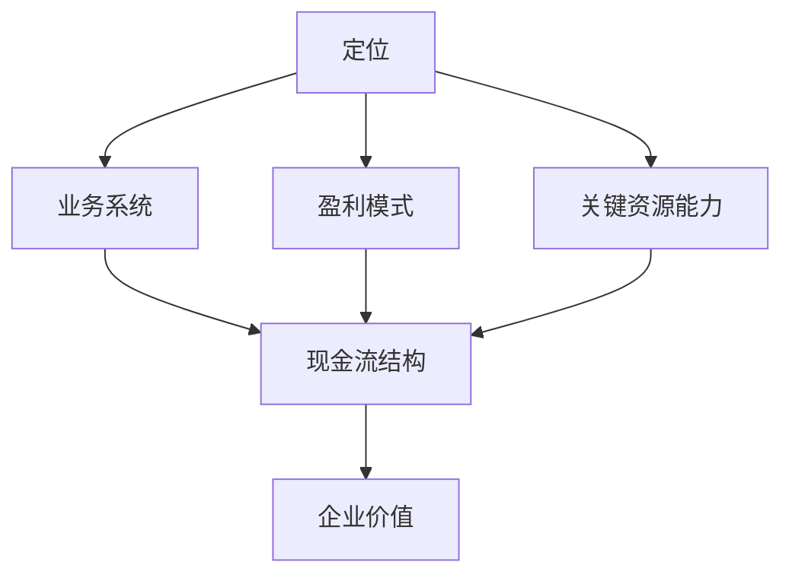

# 商业模式学原理

## What — 这是什么？

商业模式是关于"从事业务活动的利益相关者的交易结构"的系统性知识。它回答了企业如何组织资源、创造价值、获取利润的根本问题。

## Why — 为什么重要？

商业模式的优劣直接决定企业的投资价值。一个好的商业模式往往表现出自由现金流规模大、增长快的特点，并能有效利用资产杠杆、负债杠杆和价值杠杆。

## 核心框架：六要素模型

商业模式由六个相互关联的要素构成：

| 要素 | 核心问题 | 关键概念 |
|------|----------|----------|
| **定位** | 满足客户需求的方式 | 产权转移、交易过程重组、价值主张形式 |
| **业务系统** | 利益相关者的交易结构 | 业务流、资金流、信息流、物流 |
| **盈利模式** | 收入的来源与方式 | 收支方式、计费方式、收支来源、时间分布 |
| **关键资源能力** | 支撑商业模式的核心能力 | 重要性、稀缺性、获取方式、补强路径 |
| **现金流结构** | 现金流入流出的时空分布 | 经营性杠杆、财务性杠杆 |
| **企业价值** | 未来自由现金流的贴现值 | 投资价值、估值方式 |

## 详细内容

### 一、定位

商业模式定位、战略定位、营销定位是三个不同层次的概念：

- **战略定位**：企业做什么和不做什么（为哪类客户提供哪种产品）
- **营销定位**：满足客户什么样的需求（关注哪方面细分需求）
- **商业模式定位**：用什么方式满足客户及其他利益相关者的需求

**定位的思考维度**：
1. 产权（使用权、收益权、转让权）的转移
2. 交易过程各环节的重组（交易价值、交易成本、交易风险）
3. 价值主张的形式：产品？服务？解决方案？赚钱工具？

**如何定位**：
1. 盘点自身资源和能力，找到最擅长的满足方式
2. 探索客户的真实需求
3. 分析竞争对手
4. 结合产品定位设计商业模式定位

### 二、业务系统

业务系统是企业达成定位需要设计的业务活动环节，以及各利益相关者之间的交易和治理关系。

**梳理四步法**：
1. 明确交易角色
2. 明确企业与利益相关者的交易关系
3. 搞清楚交易过程中的要素传递（三个要素四类内容：业务流/资金流/信息流、产品和服务、生产要素、经营资源、经营能力）
4. 将各利益相关者的交易关系串联起来

**优化视角——三镜一加速器**：
- 广角镜：全局视角
- 多棱镜：多维度分析
- 聚焦镜：聚焦核心
- 加速器：找到增长杠杆

### 三、盈利模式

盈利模式的四个维度——"四定"：

| 维度 | 含义 |
|------|------|
| 定性 | 收支方式（收取或支付什么费用） |
| 定量 | 计费方式和计费依据（如何收入或付费） |
| 定向 | 收支来源（向谁收取或支付费用） |
| 定时 | 影响现金流（什么时候获得收入或付费） |

### 四、关键资源能力

商业模式关注的资源能力看的是"是否重要、是否不可或缺"。

**四个关键问题**：
1. 什么资源能力是关键的？
2. 如何获取这些关键资源能力？
3. 资源能力优势和竞争优势是什么关系？
4. 如何补强关键资源能力，并用以创造企业价值？

**取舍原则**：在交易风险可控的情况下，最大化"交易价值 - 交易成本"的差值。

### 五、现金流结构与企业价值

现金流结构是按利益相关者划分的现金流入流出在时间序列上的分布——包括一次性流入/流出、一次性投资、多次收入等。

**现金流结构的三重作用**：
1. 影响商业模式定位、业务系统和盈利模式设计
2. 检验各要素所能创造的投资价值
3. 作为设计金融工具的依据

**提升企业价值的三个杠杆**：
- 资产/资源/能力杠杆
- 负债杠杆
- 价值杠杆

**企业估值方式**：绝对估值法、相对估值法。

## 我的理解

商业模式六要素模型比商业模式画布（BMC）更加深入——它不只是在描述"是什么"，而是在解释"为什么"。尤其是"现金流结构"和"企业价值"这两个要素，把商业模式直接和投资回报联系起来，这是画布做不到的。

核心公式可以总结为：**好的商业模式 = 最大化（交易价值 - 交易成本）× 利益相关者参与度**

## 关联知识

- [[商业模式画布]] — 更简化的9模块框架
- [[商业模式六要素]] — 原子笔记版本
- [[商业模式定位]] — 三种定位辨析
- [[业务系统设计]] — 四步梳理法
- [[现金流结构]] — 现金流与企业价值
